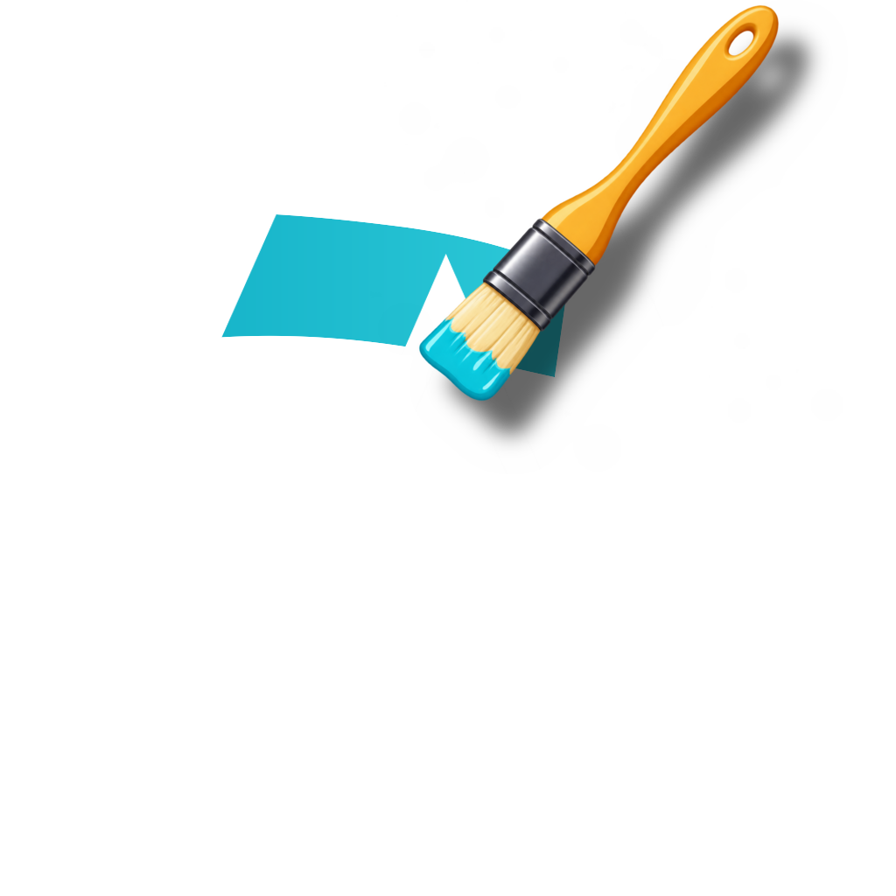

<div align="center">



# Aniki Pack Creator

**Create custom packs for Aniki ReMake in a simple visual editor.**

Add your content, preview it, save your project and export a ZIP ready for **Aniki Helper**.

<p>
  <a href="https://github.com/Mike-Aniki/AnikiPackCreator/releases/latest">
    
  </a>
  &nbsp;
  <a href="https://github.com/Mike-Aniki/AnikiPackCreator/releases">
    
  </a>
</p>

**Windows · Portable · No installation required**

</div>

---

## Create your pack

| | Pack | Customize |
|---|---|---|
| 🖼️ | **Visual Pack** | Backgrounds and interface images |
| 🔊 | **Sound Pack** | Theme sounds and ambient music |
| 🎨 | **Color Pack** | Aniki ReMake colors |
| 🎬 | **Login Pack** | Animated login background |
| 📦 | **Complete Pack** | Bundle several matching packs together |

### How it works

1. Choose a pack type.
2. Add your images, sounds, colors or video.
3. Preview and adjust the result.
4. Save your project.
5. Export the pack as a ZIP.
6. Import it with **Aniki Helper**.

---

## 🖼️ Visual Packs

Create the **14 images** used throughout Aniki ReMake.

- Drag & drop images
- Reposition and zoom directly in the preview
- Brightness, contrast, saturation and dark overlay controls
- Optional Aniki UI previews
- Reuse an image for empty slots
- Automatic Aniki image treatment
- Open existing Visual Pack folders

**Project:** `.avpc`

---

## 🔊 Sound Packs

Replace Aniki ReMake sounds and ambient music.

- 17 WAV sound slots
- 3 MP3 music slots
- Built-in play / stop preview
- Partial packs supported
- Automatic format validation
- Unchanged sounds can keep using Aniki defaults

**Project:** `.aspc`

---

## 🎨 Color Packs

Create a complete theme palette using only **15 master colors**.

The Creator automatically generates the rest of the Aniki ReMake palette and provides preview scenes for:

**Main · Hub · Menus · Details**

**Project:** `.acpc`

---

## 🎬 Login Packs

Create your own animated login background.

**Requirements:** MP4 · H.264/H.265 · Maximum 50 MB

**Project:** `.alpc`

---

## 📦 Complete Packs

Bundle matching packs together:

- **Visual Pack**
- **Login Pack**
- **Sound Pack** *(optional)*
- **Color Pack** *(optional)*

The included packs stay independent after installation, so users can replace only one part later.

**Project:** `.acmp`

---

## Updating a pack

Planning to publish your pack?

**Keep your project file.**

Each project contains a permanent Pack ID used by Aniki Helper to recognize future updates.

To release an update, reopen the **same project** and increase its version:

```text
1.0.0 → 1.1.0
```

A brand-new project gets a new Pack ID and is treated as a different pack.

---

## Share with the community

Use **Share Community Pack** inside the Creator when your pack is ready.

👉 **[Open Aniki Community Packs](https://github.com/Mike-Aniki/AnikiCommunityPacks)**

---

## Aniki ecosystem

- 🎮 **[Aniki ReMake](https://github.com/Mike-Aniki/Aniki-ReMake)** — Fullscreen Playnite theme
- 🧩 **[Aniki Helper](https://github.com/Mike-Aniki/AnikiHelper)** — Companion plugin used to install and manage packs
- 🌐 **[Aniki Community Packs](https://github.com/Mike-Aniki/AnikiCommunityPacks)** — Browse and share community creations
- 🛠️ **[Aniki Pack Creator](https://github.com/Mike-Aniki/AnikiPackCreator)** — This project

---

<div align="center">

**Create it. Export it. Share it. Make Aniki yours.**

</div>
